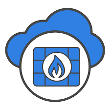

---

# FortiCloud: Strengthening Multi-Tenancy Security in Google Cloud Platform 🛡️☁️

## Overview
FortiCloud is a comprehensive project aimed at enhancing security in multi-tenant environments within Google Cloud Platform (GCP). As organizations increasingly adopt cloud computing for its scalability and flexibility, ensuring robust security measures becomes paramount. This project investigates and implements strategies to safeguard data confidentiality, integrity, and availability while empowering organizations to confidently embrace cloud technologies.

## Key Features
- **Robust Security Measures:** Implements advanced security controls and isolation mechanisms in GCP.
- **Scalable Architecture:** Designs resilient architectures using Terraform and Kubernetes Engine (GKE).
- **Integration with Fortinet Tools:** Utilizes FortiGate, FortiWeb, and FortiCASB for enhanced security.
- **Real-time Monitoring:** Implements monitoring and logging with Stackdriver for proactive security management.
- **Comprehensive Documentation:** Provides detailed guides and best practices for secure multi-tenancy.

## Getting Started
Follow these steps to deploy and secure your multi-tenant environment in GCP with FortiCloud:

### Prerequisites
- Create a Google Cloud Platform (GCP) account.
- Install Terraform CLI and configure GCP credentials.
- Set up Kubernetes Engine (GKE) for container orchestration.

### Installation Steps
1. **Clone the Repository:**
   

   <pre><code>git clone https://github.com/AkhilsaiSammeta/forticloud-security-gcp.git
   cd forticloud-security-gcp</code></pre>
   

2. **Configure Terraform:**
   - Update `terraform.tfvars` with your GCP project ID and desired configurations.
   - Initialize Terraform and apply configurations:
   

   <pre><code>terraform init
   terraform apply</code></pre>
   

3. **Deploy Kubernetes Workloads:**
   - Define your Kubernetes manifests (`deployment.yaml`, `service.yaml`) for FortiCloud applications.
   - Apply manifests to deploy your containerized workloads:
   

   <pre><code>kubectl apply -f deployment.yaml</code></pre>
   

4. **Integrate Fortinet Security Tools:**
   - Utilize FortiGate, FortiWeb, and FortiCASB APIs or SDKs for integrating with GCP services.
   - Ensure proper configuration and monitoring of security policies.

### Usage
- Access FortiCloud dashboard at `https://your-forticloud-domain.com` for real-time security monitoring and management.
- Monitor logs and events using Stackdriver Logging and Stackdriver Monitoring in GCP Console.

## Contributing
Contributions are welcome! Please fork the repository and submit pull requests for any improvements or bug fixes. Ensure to follow our [Contributing Guidelines](CONTRIBUTING.md).

## License
This project is licensed under the MIT License - see the [LICENSE](LICENSE) file for details.

---
